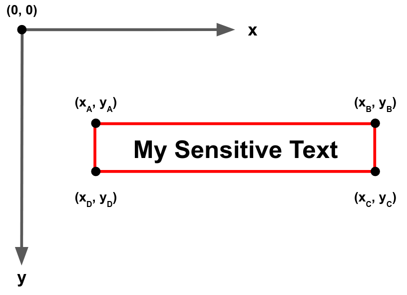
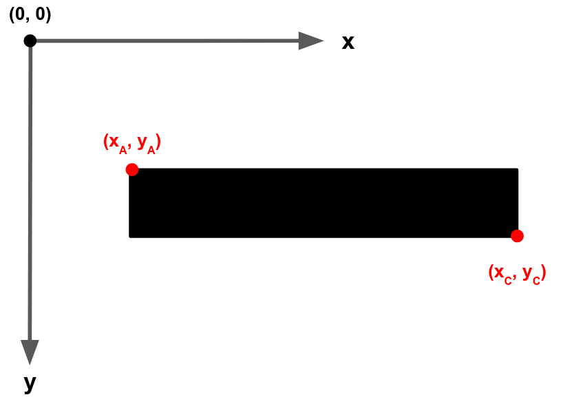
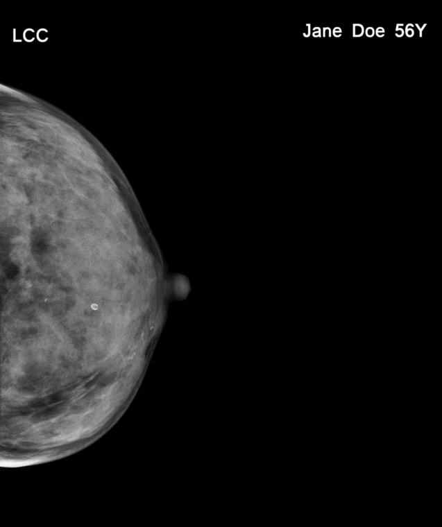
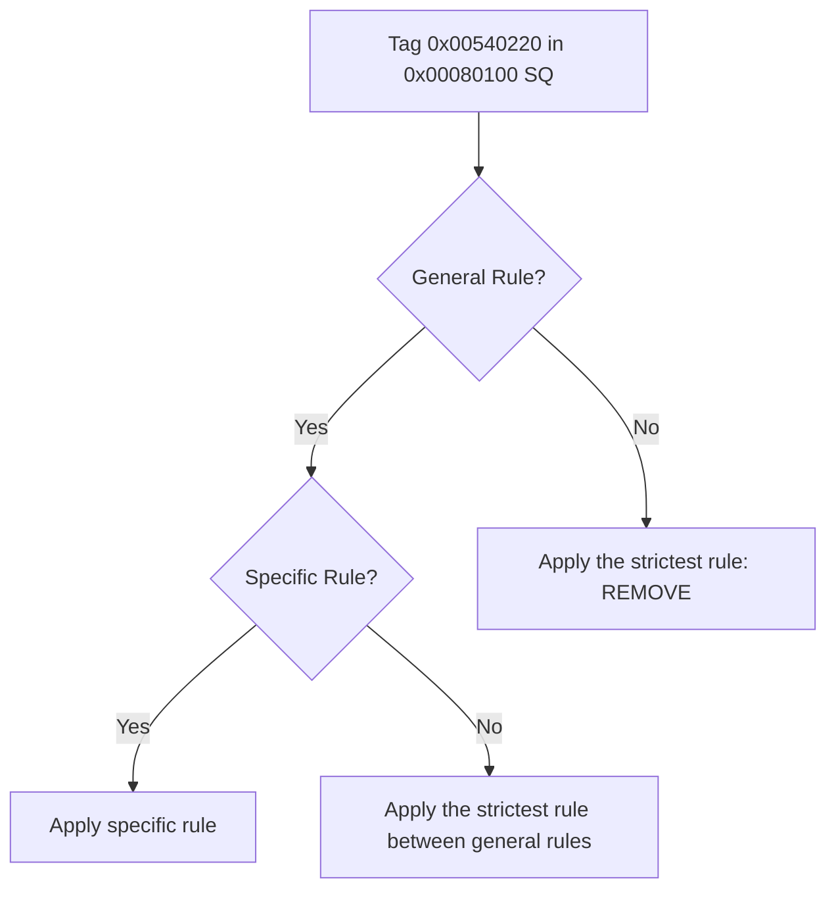

# Welcome to deidcm

## What is deidcm?

deidcm is a reusable toolset for deidentifiying **images** and **metadata** contained inside DICOM files. deidcm stands on the shoulders of giants (PyTorch, easyOCR)

This package was initially built for processing medical data from the [Deep.Piste](https://www.health-data-hub.fr/partenariats/deep-piste){:target="_blank"} study. It was primarly made for mammograms.

## Image Deidentification

Image deidentification is the process of removing text information that can be used to identify an individual from an image. Our method uses **Optical Text Recognition** (**OCR**) for retrieving all text boxes present on an image. Then, we extract image coordinates from these text boxes and use them to hide information.

{: style="height: 245px"}
{: style="height: 245px"}

deidcm image deidentifier can also work with a list of **authorized words**. This list can be used to keep useful information on your image. For instance, let's say we'd like to keep information related to *image laterality* if present on our images (circled in green in the following image). All other text information will be considered as sensible (circled in red in the following image).



!!! info
    The previous image has been obtained from the public dataset [*The Chinese Mammography Database (CMMD): An online mammography database with biopsy confirmed types for machine diagnosis of breast*](https://wiki.cancerimagingarchive.net/pages/viewpage.action?pageId=70230508#702305083240e43d037c47eba3f5325d0a08c9ac){:target="_blank"}. This dataset is accessible through the [*The Cancer Imaging Archive (TCIA) Retriever tool*](https://imaging.cancer.gov/informatics/cancer_imaging_archive.htm){:target="_blank"}.

## Attributes Deidentification

Attributes or Metadata Deidentification is the process of removing sensible text information that can be used to identify an individual from a DICOM file attributes dataset. Expand the following section to see an example of DICOM attributes dataset.

??? example
    **What does a DICOM attributes dataset look like?**
    
    Let's visualize it. In order to do so, you'll need a DICOM file.
    ```py title="visualize_dicom_dataset.py" linenums="1"
    import pydicom

    ds = pydicom.read_file("my_mammogram.dcm")
    print(ds)
    ```

    Now, you should obtain an output like the following one:
    ```bash
    Dataset.file_meta -------------------------------
    (0002, 0000) File Meta Information Group Length  UL: 208
    (0002, 0001) File Meta Information Version       OB: b'\x00\x01'
    (0002, 0002) Media Storage SOP Class UID         UI: Digital Mammography X-Ray Image Storage - For Presentation
    (0002, 0003) Media Storage SOP Instance UID      UI: 1.3.6.1.4.1.14519.5.2.1.1239.1759.58672524
    (0002, 0010) Transfer Syntax UID                 UI: Explicit VR Little Endian
    (0002, 0012) Implementation Class UID            UI: 1.3.6.1.4.1.22213.1.143
    (0002, 0013) Implementation Version Name         SH: '0.5'
    (0002, 0016) Source Application Entity Title     AE: 'POSDA'
    -------------------------------------------------
    (0008, 0005) Specific Character Set              CS: 'ISO_IR 100'
    (0008, 0008) Image Type                          CS: ['DERIVED', 'PRIMARY']
    (0008, 0012) Instance Creation Date              DA: '20170818'
    (0008, 0013) Instance Creation Time              TM: '114640'
    (0008, 0014) Instance Creator UID                UI: 1.3.6.1.4.1.14519.5.2.1.1239.1759.25669314
    (0008, 0016) SOP Class UID                       UI: Digital Mammography X-Ray Image Storage - For Presentation
    (0008, 0018) SOP Instance UID                    UI: 1.3.6.1.4.1.14519.5.2.1.1239.1759.58672524
    (0008, 0020) Study Date                          DA: '20100718'
    (0008, 0021) Series Date                         DA: '20100718'
    (0008, 0022) Acquisition Date                    DA: '20100718'
    (0008, 0023) Content Date                        DA: '20100718'
    (0008, 0030) Study Time                          TM: '000000'
    (0008, 0031) Series Time                         TM: '000000'
    (0008, 0032) Acquisition Time                    TM: '000000'
    (0008, 0033) Content Time                        TM: '000000'
    (0008, 0050) Accession Number                    SH: ''
    (0008, 0060) Modality                            CS: 'MG'
    (0008, 0068) Presentation Intent Type            CS: 'FOR PRESENTATION'
    (0008, 0070) Manufacturer                        LO: ''
    (0008, 0090) Referring Physician's Name          PN: ''
    (0008, 2218)  Anatomic Region Sequence  1 item(s) ---- 
        (0008, 0100) Code Value                          SH: '76752008'
        (0008, 0102) Coding Scheme Designator            SH: 'SCT'
        (0008, 0104) Code Meaning                        LO: 'Breast'
    ---------
    (0010, 0010) Patient's Name                      PN: 'D1-0002'
    (0010, 0020) Patient ID                          LO: 'D1-0002'
    (0010, 0030) Patient's Birth Date                DA: ''
    (0010, 0040) Patient's Sex                       CS: 'F'
    (0010, 1010) Patient's Age                       AS: '040Y'
    (0012, 0062) Patient Identity Removed            CS: 'YES'
    (0012, 0063) De-identification Method            LO: 'Per DICOM PS 3.15 AnnexE. Details in 0012,0064'
    (0012, 0064)  De-identification Method Code Sequence  8 item(s) ---- 
        (0008, 0100) Code Value                          SH: '113100'
        (0008, 0102) Coding Scheme Designator            SH: 'DCM'
        (0008, 0104) Code Meaning                        LO: 'Basic Application Confidentiality Profile'
        ---------
        (0008, 0100) Code Value                          SH: '113101'
        (0008, 0102) Coding Scheme Designator            SH: 'DCM'
        (0008, 0104) Code Meaning                        LO: 'Clean Pixel Data Option'
        ---------
        (0008, 0100) Code Value                          SH: '113104'
        (0008, 0102) Coding Scheme Designator            SH: 'DCM'
        (0008, 0104) Code Meaning                        LO: 'Clean Structured Content Option'
        ---------
        (0008, 0100) Code Value                          SH: '113105'
        (0008, 0102) Coding Scheme Designator            SH: 'DCM'
        (0008, 0104) Code Meaning                        LO: 'Clean Descriptors Option'
        ---------
        (0008, 0100) Code Value                          SH: '113107'
        (0008, 0102) Coding Scheme Designator            SH: 'DCM'
        (0008, 0104) Code Meaning                        LO: 'Retain Longitudinal Temporal Information Modified Dates Option'
        ---------
        (0008, 0100) Code Value                          SH: '113108'
        (0008, 0102) Coding Scheme Designator            SH: 'DCM'
        (0008, 0104) Code Meaning                        LO: 'Retain Patient Characteristics Option'
        ---------
        (0008, 0100) Code Value                          SH: '113109'
        (0008, 0102) Coding Scheme Designator            SH: 'DCM'
        (0008, 0104) Code Meaning                        LO: 'Retain Device Identity Option'
        ---------
        (0008, 0100) Code Value                          SH: '113111'
        (0008, 0102) Coding Scheme Designator            SH: 'DCM'
        (0008, 0104) Code Meaning                        LO: 'Retain Safe Private Option'
    ---------
    (0013, 0010) Private Creator                     LO: 'CTP'
    (0013, 1010) Private tag data                    LO: 'CMMD'
    (0013, 1013) Private tag data                    LO: '12391759'
    (0018, 0015) Body Part Examined                  CS: 'BREAST'
    (0018, 1164) Imager Pixel Spacing                DS: [0.094090909, 0.094090909]
    (0018, 1508) Positioner Type                     CS: 'MAMMOGRAPHIC'
    (0018, 7004) Detector Type                       CS: 'SCINTILLATOR'
    (0020, 000d) Study Instance UID                  UI: 1.3.6.1.4.1.14519.5.2.1.1239.1759.24151979
    (0020, 000e) Series Instance UID                 UI: 1.3.6.1.4.1.14519.5.2.1.1239.1759.61082364
    (0020, 0010) Study ID                            SH: ''
    (0020, 0011) Series Number                       IS: '1'
    (0020, 0013) Instance Number                     IS: '2'
    (0020, 0020) Patient Orientation                 CS: ['A', 'FR']
    (0020, 0062) Image Laterality                    CS: 'L'
    (0028, 0002) Samples per Pixel                   US: 1
    (0028, 0004) Photometric Interpretation          CS: 'MONOCHROME2'
    (0028, 0010) Rows                                US: 2294
    (0028, 0011) Columns                             US: 1914
    (0028, 0100) Bits Allocated                      US: 8
    (0028, 0101) Bits Stored                         US: 8
    (0028, 0102) High Bit                            US: 7
    (0028, 0103) Pixel Representation                US: 0
    (0028, 0301) Burned In Annotation                CS: 'NO'
    (0028, 0303) Longitudinal Temporal Information M CS: 'MODIFIED'
    (0028, 1040) Pixel Intensity Relationship        CS: 'LOG'
    (0028, 1041) Pixel Intensity Relationship Sign   SS: -1
    (0028, 1050) Window Center                       DS: '128.0'
    (0028, 1051) Window Width                        DS: '256.0'
    (0028, 1052) Rescale Intercept                   DS: '0.0'
    (0028, 1053) Rescale Slope                       DS: '1.0'
    (0028, 1054) Rescale Type                        LO: 'US'
    (0028, 1055) Window Center & Width Explanation   LO: 'Full width of 8 bit data'
    (0028, 1056) VOI LUT Function                    CS: 'SIGMOID'
    (0028, 2110) Lossy Image Compression             CS: '00'
    (0040, 0318) Organ Exposed                       CS: 'BREAST'
    (0040, 0555)  Acquisition Context Sequence  0 item(s) ---- 
    (0054, 0220)  View Code Sequence  1 item(s) ---- 
    (0008, 0100) Code Value                          SH: '399368009'
    (0008, 0102) Coding Scheme Designator            SH: 'SCT'
    (0008, 0104) Code Meaning                        LO: 'medio-lateral oblique'
    (0054, 0222)  View Modifier Code Sequence  0 item(s) ---- 
    ---------
    (2050, 0020) Presentation LUT Shape              CS: 'IDENTITY'
    (7fe0, 0010) Pixel Data                          OB: Array of 4390716 elements
    ```

!!! info
    The previous dataset has been obtained from the public dataset [*The Chinese Mammography Database (CMMD): An online mammography database with biopsy confirmed types for machine diagnosis of breast*](https://wiki.cancerimagingarchive.net/pages/viewpage.action?pageId=70230508#702305083240e43d037c47eba3f5325d0a08c9ac){:target="_blank"}. This dataset is accessible through the [*The Cancer Imaging Archive (TCIA) Retriever tool*](https://imaging.cancer.gov/informatics/cancer_imaging_archive.htm){:target="_blank"}.

### The customizable recipe

The attributes deidentifier is based on a **customizable recipe** which is a file describing deidentification actions for each DICOM attribute. The recipe file is written in [JSON](https://json.org/json-fr.html){:target="_blank"}:

```json
{
    "general_rules": {
        "0x00020000": [
            "FileMetaInformationGroupLength",
            "UL",
            "CONSERVER"
        ],
        "0x001811BB": [
            "AcquisitionFieldOfViewLabel",
            "LO",
            "PSEUDONYMISER"
        ],
        "0x001021B0": [
            "AdditionalPatientHistory",
            "LT",
            "RETIRER"
        ]
        "0x00080032": [
            "AcquisitionTime",
            "TM",
            "EFFACER"
        ]
    },
    "specific_rules": {
        "0x00080100": {
            "sequence": "0x00540220",
            "rule": "CONSERVER"
        },
        "0x00080104": {
            "sequence": "0x00540220",
            "rule": "CONSERVER"
        },
        "0x00080102": {
            "sequence": "0x00540220",
            "rule": "CONSERVER"
        }
    }
}
```

### General and Specific Rules

The recipe file contains 2 types of rules:

|  **Type of Rules** |                     **Description**                    |
|:------------------:|:------------------------------------------------------:|
|  **General Rules** |   A basic rule. It can be defined for any attribute.   |
| **Specific Rules** | A rule used to target a child attribute of a sequence. |

**How do we use these rules?**

- In practice, we'll mostly use **general rules**. They allow us to apply a given deidentification action on a targeted attribute.
- **Specific rules** find their use when we want to target an generic attribute inside a sequence. By generic, we refer to an attribute that is used several
    times in the dataset but inside different sequences. Let's see an example:

!!! example
    In the following dataset, we have **2 sequences** that hold very different types of information. However, these sequences use the same children attributes.
    ```bash
    (0012, 0064)  My First Sequence  3 item(s) ---- 
        (0008, 0100) Code Value                          SH: 'A1'
        (0008, 0102) Coding Scheme Designator            SH: 'Mam'
        (0008, 0104) Code Meaning                        LO: 'Mammogram'
        ---------
        (0008, 0100) Code Value                          SH: 'A2'
        (0008, 0102) Coding Scheme Designator            SH: 'MamR'
        (0008, 0104) Code Meaning                        LO: 'Mammogram Reader'
        ---------
        (0008, 0100) Code Value                          SH: 'A3'
        (0008, 0102) Coding Scheme Designator            SH: 'SE'
        (0008, 0104) Code Meaning                        LO: 'Study Exam'
    ---------
    (0013, 0242)  My Second Sequence  1 item(s) ---- 
        (0008, 0100) Code Value                          SH: 'BT-67'
        (0008, 0102) Coding Scheme Designator            SH: 'XRC'
        (0008, 0104) Code Meaning                        LO: 'ACQUISITION: X-RAY CHEST'
    ---------
    ```

    **Case n°1**: Delete all `Code Meaning` attributes

    We set a general rule for the attribute `Code Meaning` with the action `RETIRER`.

    **Case n°2**: Delete all `Code Meaning` attributes **except those inside** `My Second Sequence` 

    - We set a general rule for the attribute `Code Meaning` with the action `RETIRER`.
    - We set a specific rule for the attribute `Code Meaning` inside `My Second Sequence`.


!!! warning
    If a **general rule** is defined for a given sequence. The rule applied to the children will be the strictest between the sequence rule and the sequence child rule.

!!! warning
    If a **general rule** is defined for a given sequence and children have **specific rules**, the **specific rules** will override the **general rule**



### Define your own recipe

A `recipe.json` file is already available inside deidcm package. However, it is possible to define your own `recipe.json`. In order to specify a custom recipe, use the [the Config object][deidcm.dicom.deid_mammogram.Config]. 

!!! warning
    The inbuilt `recipe.json` file was created for the [Deep.Piste](https://www.health-data-hub.fr/partenariats/deep-piste){:target="_blank"} study. It was made for mammograms only and you should probably define ***your own file meeting your own needs***.

    If you don't define a new `recipe.json` folder, deidcm will show a warning and automatically use its inbuilt referential.

In order to do define your own `recipe.json`, you'll have to create the file `recipe.json` and respect this structure :

```json
{
    "general_rules": {
        "HEXADECIMAL_DICOM_TAG_ATTRIBUTE": [
            "AttributeName",
            "AttributeType",
            "DeidentificationAction"
        ],
        ...
    },
    "specific_rules": {
        "HEXADECIMAL_DICOM_TAG_OF_CHILD_ATTRIBUTE": {
            "sequence": "HEXADECIMAL_DICOM_TAG_OF_SEQUENCE_ATTRIBUTE",
            "rule": "DeidentificationAction"
        },
        ...
    }
}
```

!!! note
    * `AttributeName` is only used for making the file readable for humans
    * `AttributeType` is the attribute's [DICOM Value Representation (VR)](https://dicom.nema.org/dicom/2013/output/chtml/part05/sect_6.2.html){:target="_blank"}. It is represented by two letters.
    * `DeidentificationAction` is a string that defines which action deidcm deidentifier will take for a specific attribute. This value should be among the possible actions in the below table.

| **Action (French Name)** | **Equivalent in English** |                              **Description**                              |
|:------------------------:|:-------------------------:|:-------------------------------------------------------------------------:|
|         CONSERVER        |            KEEP           |                        The attribute will be kept.                        |
|          EFFACER         |           ERASE           | The attribute will still be in the dataset but its value will be blanked. |
|          RETIRER         |           REMOVE          |              The attribute will be removed from the dataset.              |
|       PSEUDONYMISER      |         DEIDENTIFY        |                    The attribute will be deidentified.                    |

!!! warning
    English names are not supported inside the `recipe.json`. The equivalent column above is just for information purposes.